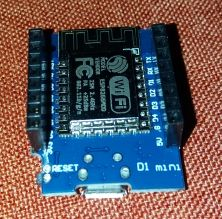
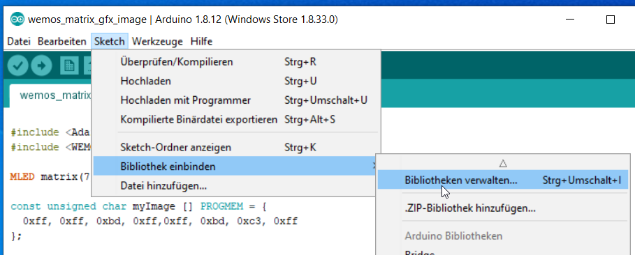
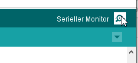

Allgemeiner Einstieg in die Embedded Programmierung
===================================================


[Installation der Entwicklungsumgebung](ESP8266/README.md)
---------------------------------------------------------
Wir fangen mit der [installation der Entwicklungsumgebung](../ESP8266/README.md) an.
Danach machen wir mit einfachen Programmierbeispiele weiter. Das zeigt uns auch gleich ob die Entwicklungsumgebung richtig installiert ist.
Hierzu verwenden wir das einfache Blink Beispiel, das beim Compiler für den ESP8266 dankenswerter Weise gleich als Beispiel mit kommt.


Planung und Strukturierung eines Projektes
------------------------------------------

 - *Ermitteln der Zeilstellung:*

   In unserem Fall gilt es eine kleines Embedded Gerät zu designen, zu bauen und zu programmieren.
   Da unser aller Leben gerade durch Covid sehr geprägt ist wollen wir einen Bezug dazu herstellen.
   Inspiriert durch andere Programmierer und deren Projekte wollen wir daher einen "Hand Wasch Timer" bauen.

 - *Brainstorming:*

   Am Anfang eines Projektes liegt üblicherweise die Brainstorming Phase.
   Dieser Phase überlegen wir uns wie wir unser Ziel erreichen können.
   Welche Funktionen soll das Gerät am Ende haben?
   Unser Ziel ist es ja, daß wir dabei unterstützt werden unsere Hände lange genug mit Seife zu waschen.
   Daher brauchen wir irgend etwas, daß uns signalisiert wenn wir unsere Hände lange genug gewaschen haben.
   Da wir auch wissen, daß die minimale Zeit zum Händewaschen 20 Sekunden sein sollte ist eine weitere Vorraussetzung diese 20Sekunden zu timern.
   Jetzt fehlt uns noch irgendwas das den ganzen Vorgang einleitet; sozusagen ein Start Trigger.
   Da wir als Menschen gerne ungeduldig sind wollen wir auch gerne wissen, wie lange es noch dauert. Also wäre ein nettes plus für uns während des Timers zu sehen wie lange wir noch waschen müssen.


 - *Welche Komponenten werden benötigt*:

   Im nächsten Schritt ermitteln wir welche Komponenten wir brauchen um dieses Ziel zu erreichen. In unserem Fall brauchen wir also
    - Etwas zu triggern des Anfangs (Wir haben hier einen Distanzsensor gewählt)
    - Eine Komponente, die uns die 20 Sekunden ermittelt (als Timer wählen wir entweder die Funktion sleep() oder miliseconds() )
    - Eine Komponente, die uns sagt wie weit wir sind und diese als Fortschrittsanzeige visualisiert (Als Fortschrittsanzeige wählen wir entweder einen Modelbau-Servo mit Zeiger oder einen Neopixel Ring) 
    - Eine Komponente die uns das Ende signalisiert (Hier kann die Fortschrittsanzeige verwendet werden)

Dadurch ergeben sich dann auch die Komponenten die für das Projekt gebraucht werden.

Ein nächster Schritt ist es die einzelnen Komponenten Komponenten separiert voneinander ans laufen zu bekommen.
Für den ersten Versuch verwenden wir die Variante mit einem Modellbau-Servo als Fortschrittsanzeige.
In unserem Fall sind es also
 - Das Grundsystem (Die embedded CPU mit der Platine)
 - Der Modellbau-Servo
 - Der Distanzsensor.
Jede diese Komponenten kann man einzeln testen und sich mit der Bedienung und Verwendung vertraut machen.


Das Grundsystem (Die embedded CPU mit der Platine)
--------------------------------------------------

Fangen wir mit der CPU Platine an. In unserem Fall verwenden wir einen Wemos D1 Mini.



Der Vorteil dieser Platine ist dass man sehr wenig Löten muss um sie ans laufen zu bekommen.
Zudem gibt es schon fertige [Shields](../ESP8266/Hardware/img/Wemos-D1-Mini) mit denen man schon recht viel anfangen kann. 


Mitgelieferte Beispiele
-----------------------

Um sich mit einer Bibliothek und einem neuen Gerät vertraut zu machen, ist ein schöner Einstieg die Beispiele zu dieser Bibliothek.

Als erstes Beispiel verwenden wir das 
[Standard Blink example](https://github.com/wemos/D1_mini_Examples/blob/master/examples/02.Special/DeepSleep/Blink/Blink.ino) 
das in der oben installierten [Entwicklungsumgebung](./README.md#Entwicklungsumgebung) schon mitgeliefert wird.


### Beispiele laden

Die Beispiele findet man unter Datei --> Beispiele.


Das Blink 
Das klappt natürlich nur, nachdem die Bibliothek in der Arduino-IDE installiert wurde.
Üblicherweise bringen die Bibliotheken schon Beispiele mit, die die Verwendung der Bibliothek und die Ansteuerung des Sensors zeigen.


Grundaufbau von Arduino Sketches
--------------------------------

### setup
 
```C
 setup()
```
 	
Dieser Teil im code wird beim Booten des Embeded Gerätes einmalig ausgeführt. Hier kann man Initialisierungen 
und einmal aus zu führende Aufgaben unter bringen.
Beispiel:

```C
		void setup() {
  			myservo.attach(D3);  // attaches the servo on pin D3 to the servo object
		}
```

In diesem Beispiel wird z.B. der Servo mit dem Pin D3 verbunden


### loop

```C
	loop()
```

Dieser Teil wird immer wieder ausgeführt. Hier spielt sich normalerweise das Hauptgeschehen unseres Programmes ab.


Bibliotheken für weitere Komponenten
------------------------------------
Viele verschiedene Geräte (Sensoren und Aktoren) können von so einem Embeded System angesteuert/abgefragt werden.
Damit sich nicht jeder Entwickler wieder von neuem mit der Programmierung der Low-Level Funktionen dieser Geräte kümmern muss
haben einige Programmierer sich die Mühe gemacht und die grundsätzliche Ansteuerung solcher Geräte in eine Bibliothek zu verpacken.
Dieser Umstand macht uns das Leben sehr viel leichter.
Daher schauen wir als aller erste nach, ob es denn schon eine Bibliothek zur Verwendung des von uns gewünschten Gerätes gibt.

Hierbei gehen wir so vor, daß wir zuerst die benötigte Bibliothek anhand der Typenbezeichnung des Sensors oder Gerätes identifizieren.
Viele der Bibliotheken sind schon direkt in der Bibliotheksverwaltung innerhalb der IDE direkt herunterladbar.



Wenn man hier die entsprechende Bibliothek gefunden hat einfach auswählen und installieren.


Viele Bibliotheken haben einen sehr ähnlichen Aufbau und sind zur Verwendung in ihrem Interface (Das was ein anderer Programmierer wissen muss) recht ähnlich aufgebaut.
Daher versuche ich hier anhand verschiedener Beispiele die Hauptkomponenten zur Verwendung einer Bibliothek zu erläutern.

### Einbinden der Bibliothek

Um eine Bibliothek zu verwenden müssen wir dem compiler sagen, welche Bibliothek er mit verwenden soll.
Dazu wird die Header Datei der Bibliothek mit einem ``#include<>`` Statement eingebunden.

```C
	#include<BibliotheksName.h>
```

Beispiel 1: 
```C
	#include <Servo.h>
```

Beispiel 2:
```C
	#include <WEMOS_Matrix_GFX.h>
```
 		
### Objekte definieren

Als nächstes wird ein Objekt definiert mittels dessen später auf die Resource (Sensor/Aktor) zugegriffen werden kann.
Dieses generierte Objekt könnte auch optionale Parameter beinhalten. 
 	
Beispiel 1:
```C
	Servo myservo;  // create servo object to control a servo
                	// twelve servo objects can be created on most boards
```
 	
Beispiel 2:

```C
	MLED mled(4); // Hier wird die Helligkeit der LEDs in der LED-Matrix mit angegeben.
```
 		
 

Projektstruktur mit Dateien
---------------------------

Die Arduino-IDE verwaltet ihre Projekte immer in Unterordnern. Dieser Unterordner muss den gleichen Namen haben wie das Hauptprogramm. Das Hauptprogramm hat dann die Endung ".ino".
In dem Order dürfen dann noch weitere Dateien sein.


Versionsverwaltung
------------------

Bevor ihr tiefer in die Programmierung einsteigt, kann ich noch empfehlen, sich mit einem Versionsverwaltungssystem zu beschäftigen.
Es macht Sinn, nach jedem Schritt, den man ans laufen bekommen hat diesen im Versionsverwaltungssystem zu sichern. Prominente Versionsverwaltungssysteme sind SVN oder GIT.


Arduino Sprachreferenz
----------------------

Zur eigentlichen Programmierung mit der Arduino IDE und über die Sprache finden sich viele Links. Die Original Referenz bei arduino.cc ist für das meisste ein guter Einstieg. 
 - [Sprachreferenz](https://www.arduino.cc/reference/en/)


Pinbezeichnungen
----------------

Bei den Bezeichnungen für Pins muss man ein wenig aufpassen. Es gibt einen Unterschied zwischen D3 vs. 3 vs. GPIO3. Ein wenig mehr dazu findet ihr unter:
[Pinouts-Specialties](../ESP8266/Wemos-D1-Mini/Pinouts-Specialties/)


Debugging
---------


Diese ist bei den Wemos-D1-Mini an den USB-Seriell-Konverter verbunden und kann durch den seriell Monitor in der IDE (Symbol rechts oben) zur Anzeige gebracht werden.

```
	// Initialisierung der Seriellen Schnittstelle.
	Serial.begin(115200);
```

Der default für die serielle Schnittstelle ist in der IDE auf 9600 eingestellt. 
Da viele Beispiele aber 115200 als Baudrate verwenden starten wir hier auch mit 
115200 Baud. Dazu in der IDE bei geöffnetem Seriell Monitor rechts unten die 
Baudrate umstellen.

Als erstes fangen wir eine neue Zeile an, da vorher oft wirre Zeichen in der Konsole zu sehen sind.

```
	Serial.println("");
```
  

 - Serieller Monitor
 Um die Ausgaben sehen zu können verwenden wir den seriellen Monitor. Dieser kann mit dem Button 
 
 aktiviert werden.
 
 
Tips:
 - Falscher Code wird ausgeführt
   - Es scheint so wie wenn ihr euch verrannt habt.
   - Ihr seid fest davon überzeugt, daß das was ihr gerade geändert habe eigentlich funktionieren sollte.
   - Aber euer Programm reagiert immer noch so wie vor der Änderung, die eigentlich eine Verhaltens-Besserung bringen sollte.
   
   --> Dann könnte es sein, daß eure Änderung gar nicht auf dem Embeded Gerät landet. Ein erster Blick auf die Ausgabe des Compilers und des Upload Prozesses zeigt hier oft schon einen Hinweis. 
   Sollte das auch nichts bringen, dann macht einfach mal eine Änderung, bei der ihr sicher seid, daß sie sich auch auswirken muss; ladet diese auf den Arduino/Wemos und schaut ob sich das was ihr erwartet auch ändert.
   
  

Mehr Beispiele
--------------

Weitere Beispiele für den Wmos-D1-Mini findest du [in der Sektion Wemos-D1-Mini](../ESP8266/Wemos-D1-Mini/).
